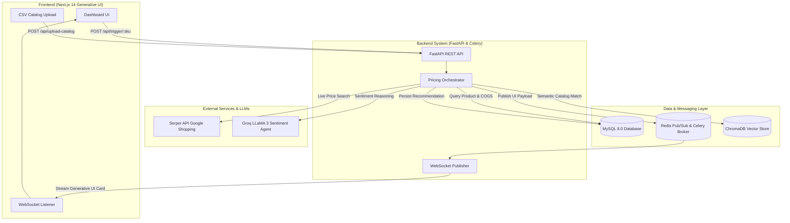

# 🛍️ Autonomous E-Commerce Competitive Intelligence & Dynamic Pricing Engine

An enterprise-grade, real-time autonomous competitive intelligence and dynamic pricing engine powered by **Next.js 14 Generative UI**, **FastAPI**, **Serper Live Web Scraping**, **Groq LLaMA 3 Sentiment Reasoning**, **ChromaDB Vector Matching**, **Celery Async Task Queues**, and **Deterministic Margin Guardrails**.

---

## ✨ Key Features

- **🌐 Live Web & E-Commerce Scraping**: Scrapes real-time live prices directly from Indian e-commerce marketplaces (**Amazon.in**, **Flipkart**, **Croma**, **Reliance Digital**, etc.) via Serper Google Shopping API and Playwright.
- **🎨 Real-Time Generative UI Dashboard**: Streams dynamic UI recommendation cards over WebSockets via Redis Pub/Sub directly to a Next.js 14 App Router dashboard with zero page reloads.
- **🔎 Dynamic SKU & Product Search**: Type ANY product name or SKU (e.g. `ASUS TUF Gaming F16`, `iPhone 15 Pro`, `Sony WH-1000XM5`), whether tracked in inventory or not, to trigger live web price discovery.
- **🛡️ Strict Non-Bypassable Margin Guardrails**: Guarantees zero negative margins and strict Minimum Advertised Price (MAP) compliance through deterministic pricing bounds:
  $$\text{Price Floor} = \max\left(\text{COGS} \times (1.0 + \text{Min Margin \%}),\ \text{MAP Price}\right)$$
- **📤 CSV Catalog & Sourcing Import**: Upload wholesale purchase costs (**COGS**) and inventory catalog files via CSV with instant database synchronization.
- **🇮🇳 Indian Rupee (INR / ₹) Native Support**: Full locale-specific pricing formatting (`Intl.NumberFormat('en-IN')`) across all charts, tables, and notifications.
- **✅ One-Click Live Price Approval**: Instant approval workflow that marks recommendations as approved, updates active database pricing, and synces store catalogs.

---

## 🏗️ Architecture Diagram



---

## 🛠️ Technology Stack

| Layer | Technology | Description |
|---|---|---|
| **Frontend** | Next.js 14, TypeScript, Tailwind CSS, Recharts, Framer Motion | Dynamic Generative UI Component Registry & WebSocket client |
| **Backend API** | FastAPI, Uvicorn, Python 3.11, Pydantic v2 | High-performance async REST API & WebSocket handlers |
| **Async Tasks** | Celery 5, Redis 7 | Scheduled cron scanning background tasks & Pub/Sub broker |
| **Database** | MySQL 8.0, SQLAlchemy ORM, Alembic | Relational database mapping products, prices, and audit logs |
| **Vector DB** | ChromaDB | Semantic vector embeddings for product SKU matching |
| **AI Agents** | Groq LLaMA 3 API | Natural language sentiment & market demand reasoning |
| **Web Scrapers** | Serper Shopping API & Playwright | Real-time live market price extraction |

---

## 🚀 Quickstart & Docker Deployment

### 1. Prerequisites
- [Docker Desktop](https://www.docker.com/products/docker-desktop/) installed & running on your machine.
- Git.

### 2. Clone the Repository
```bash
git clone https://github.com/Vansh-2102/Autonomous-E-Commerce-Competitive-Intelligence-Dynamic-Pricing-Engine.git
cd Autonomous-E-Commerce-Competitive-Intelligence-Dynamic-Pricing-Engine
```

### 3. Configure Environment Variables
Copy `.env.example` to `.env`:
```bash
cp .env.example .env
```
Fill in your API keys in `.env`:
```env
GROQ_API_KEY=your_groq_api_key_here
SERPER_API_KEY=your_serper_api_key_here
```

### 4. Launch the Complete Containerized Stack
Run a single Docker command from the project root:
```bash
docker-compose up -d --build
```

---

## 🚢 Docker Container Port Summary

| Container Name | Local URL / Port | Description |
|---|---|---|
| **`pricing_frontend`** | `http://localhost:3000/dashboard` | Next.js 14 Dashboard UI |
| **`pricing_fastapi`** | `http://localhost:8000` | FastAPI REST Backend (Swagger Docs: `http://localhost:8000/docs`) |
| **`pricing_mysql`** | `localhost:3307` mapped to `3306` | MySQL 8.0 Relational Database |
| **`pricing_redis`** | `localhost:6379` | Redis Cache & Pub/Sub Broker |
| **`pricing_chroma`** | `localhost:8001` mapped to `8000` | ChromaDB Vector Store |
| **`pricing_celery_worker`**| Background Service | Asynchronous task execution engine |
| **`pricing_celery_beat`**  | Background Service | Recurring cron pricing cycle scheduler |

---

## 📡 API Reference & Endpoints

| Method | Endpoint | Description |
|---|---|---|
| `GET` | `/api/products` | Returns list of all tracked catalog products & baseline prices |
| `POST` | `/api/products` | Registers a new product into the database catalog |
| `POST` | `/api/trigger/{sku}` | Triggers live web search & streams a Generative UI card for ANY SKU |
| `POST` | `/api/approve/{sku}` | Approves latest recommended price & updates active store selling price |
| `POST` | `/api/upload-catalog` | Uploads a CSV catalog file containing SKUs and wholesale COGS costs |
| `WS` | `/ws/pricing-feed` | WebSocket connection streaming real-time Generative UI card payloads |

---

## 📤 CSV Catalog Import Format

You can upload catalog items and wholesale purchase costs (**COGS**) directly via the UI upload button or API using a `.csv` file:

```csv
sku,name,cogs,min_margin_pct,map_price
IPHONE-15-PRO,iPhone 15 Pro 128GB,105000,0.15,124900
ASUS-ROG-STRIX,ASUS ROG Strix G16,120000,0.12,139990
BOSE-QC45,Bose QuietComfort 45,22000,0.18,26900
```

---

## 🧮 Pricing Engine Guardrail Logic

```python
# Pure Deterministic Margin Calculation
market_avg = sum(live_competitor_prices) / len(live_competitor_prices)
demand_multiplier = 1.0 + (sentiment_score * 0.05)
target_price = market_avg * demand_multiplier

# Non-Bypassable Floor Enforcement
margin_floor = cogs * (1.0 + min_margin_pct)
guardrail_price_floor = max(margin_floor, map_price)

final_price = max(guardrail_price_floor, target_price)
```

---

## 📄 License

Distributed under the MIT License. See `LICENSE` for more information.
